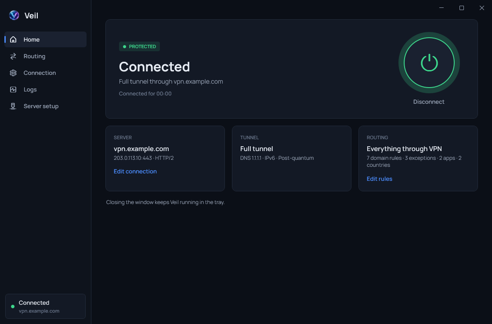
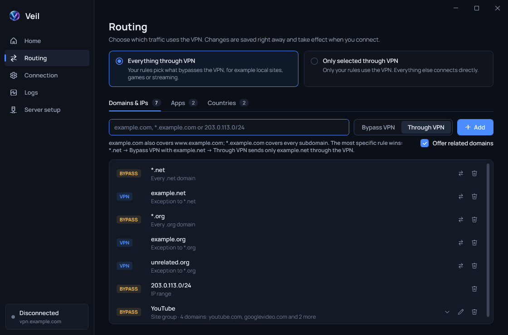

<p align="center">
  
</p>

# Veil

[](https://github.com/dmiganoid/Veil/actions/workflows/ci.yml)
[](https://github.com/dmiganoid/Veil/releases/latest)
[](LICENSE)

Veil is a Windows desktop client for TrustTunnel VPN. It runs VeilEngine, a TrustTunnel client build with per-application routing and domain exceptions, and adds split tunneling, server setup over SSH, logs and a tray-first workflow.

<p align="center">
  
  
</p>

## Features

- Connect and disconnect from the window or the tray icon; optionally start in the tray when you sign in.
- Full tunnel (all apps through a Wintun adapter) or System proxy (proxy-aware apps only).
- Routing rules by domain, wildcard, IP address or range, application and GeoIP country.
- Exceptions: for example, `*.net` bypasses the VPN while `example.net` still goes through it.
- Site groups: when you add a site, Veil offers the domains it loads content from (CDNs, APIs).
- Suggestions from the engine log for domains that are not covered by a rule yet.
- Remote server setup over SSH with certificate and service checks.
- JSON import and export of the client settings, including routing rules.
- Single-instance protection and graceful VPN process cleanup.

## Install

Download `Veil-Setup-win-x64.exe` from the [latest release](https://github.com/dmiganoid/Veil/releases/latest) and run it. The installer:

- installs Veil for all users into `C:\Program Files\Veil` (Veil needs administrator rights to create its network adapter, so its files live where only administrators can change them);
- adds a Start menu shortcut and, optionally, a desktop shortcut;
- can start Veil in the tray at sign-in (a scheduled task, because Windows does not auto-start elevated programs from the Run key);
- upgrades an existing installation in place and asks you to close Veil if it is running;
- is listed in *Settings → Apps*, and its uninstaller offers to keep or delete your settings.

Settings are stored per user in `%APPDATA%\Veil`. A portable build (`Veil-portable-win-x64.zip`) is also published.

## Routing

Pick the default route on the **Routing** page:

| Mode | Unmatched traffic | Rules |
| --- | --- | --- |
| Everything through VPN | VPN | bypass the VPN |
| Only selected through VPN | direct | use the VPN |

Domain rules and exceptions use the engine's syntax:

| Entry | Matches |
| --- | --- |
| `example.com` | `example.com` and `www.example.com` |
| `*.example.com` | every subdomain of `example.com`, not the domain itself |
| `*.net` | every `.net` domain |
| `203.0.113.7`, `203.0.113.7:443`, `[2001:db8::1]:443` | an address, optionally with a port |
| `203.0.113.0/24`, `2001:db8::/32` | an IP range |
| `*:8080` | any address on a port |

Domains in other scripts are converted to punycode (`пример.рф` → `xn--e1afmkfd.xn--p1ai`).

**Exceptions** take the opposite route of the rules and are available for domain patterns. The most specific entry wins: with the rule `*.net → Bypass VPN` and the exception `example.net → Through VPN`, only `example.net` (and `www.example.net`) uses the VPN; every other `.net` site connects directly. Add `*.example.net` as a second exception to include its subdomains. The Routing page shows which rule each exception overrides and warns about exceptions that override nothing.

Exceptions override broader domain rules. They do not override app or country rules, which match before the destination name is known. Routing rules apply in Full tunnel mode only.

## Development

Requirements: Windows 10/11 x64, .NET SDK 9.0, and the VeilEngine runtime (`client\trusttunnel_client.exe` and `client\wintun.dll`).

```powershell
powershell -NoProfile -ExecutionPolicy Bypass -File scripts\download_deps.ps1
dotnet build Veil.sln
dotnet run --project Veil.Tests\Veil.Tests.csproj
```

`download_deps.ps1` downloads the VeilEngine runtime from the latest Veil release. Domain exceptions need VeilEngine 0.2 or later; to build it yourself, see [engine/README.md](engine/README.md). Veil runs elevated, so start it from an elevated terminal or Visual Studio running as administrator.

Project layout:

```text
App.xaml, MainWindow.xaml   startup and the window shell (navigation, tray, exit)
Views/                      pages: Home, Routing, Connection, Logs, Server setup
Dialogs/                    themed message, prompt and related-domains dialogs
Themes/                     colors, typography and control styles
Services/                   VPN process, configuration, TOML generation, split tunnel, setup over SSH
Models/                     configuration and routing data
installer/Veil.iss          Inno Setup installer script
engine/patches/             VeilEngine patch for the TrustTunnel client
```

## Release

```powershell
powershell -NoProfile -ExecutionPolicy Bypass -File scripts\build_release.ps1
```

The script runs the tests, publishes a self-contained build and compiles the installer with [Inno Setup 6](https://jrsoftware.org/isdl.php). Everything is written to `release\<version>\`:

```text
Veil\                         the published app (runs without installation)
Veil-Setup-win-x64.exe        installer
Veil-portable-win-x64.zip     portable build
VeilEngine-win-x64.zip        engine runtime used by download_deps.ps1
SHA256SUMS.txt
```

Build intermediates go to `artifacts\`, so a Veil copy running from `bin\` is never overwritten. Pass `-SkipInstaller` to build without Inno Setup.

## License

Veil is released under the Apache License 2.0. See [LICENSE](LICENSE).
